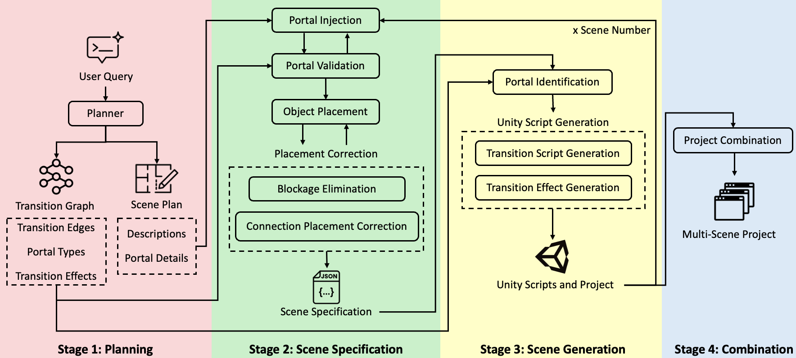
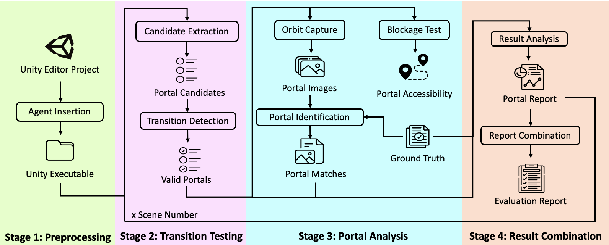

# 🪄✨ MAGIC: Multi‑scene Automated Gameworlds Generation with Intelligent Connectivity via Large Language Models 🎮🤖

[Tsz Hei Fan](https://github.com/thisishei), 
[Choi Wing Fung](https://github.com/sereneee1201),
[Yuxuan Wan](https://github.com/yxwan123),
[Shuqing Li](https://shuqing-li.github.io/), 
[Michael R. Lyu](https://www.cse.cuhk.edu.hk/lyu/home)

[Setup](#-setup) | [Run Generation](#-run-magic-for-generation) | [Run Evaluation](#-run-magic-for-evaluation) | [Acknowledgement](#-acknowledgement)

## 🛠️ Setup
1. Install conda package

```bash
conda create -n magic python=3.10 -y
conda activate magic
conda install pytorch==2.5.1 torchvision==0.20.1 torchaudio==2.5.1 cpuonly -c pytorch -y
python -m pip install -e ".[gen]"
```

2. Install preprocessed 3D objects from [ObjaTHOR](https://github.com/allenai/objathor) and [Holodeck](https://github.com/allenai/Holodeck) (~ **23 GB**)

```bash
python -m pip install -e ".[objathor]"
download-objathor_holodeck
download-objathor_assets
download-objathor_annotations
download-objathor_features
```

3. Install [Blender](https://www.blender.org/download/) and [Unity](https://www.blender.org/download/) (version 6000.0.24f1 was used in development)

## 🔮 Run MAGIC for generation
<div align=center>

</div>

```text
python magic/pipeline.py -p PROMPT [-i CASE_IDX] [-c CONFIG] [-s FLAGS]

Options:
   -p, --prompt PROMPT        Text prompt for scene generation (required)
   -i, --case_idx CASE_IDX    Case index for the generated scenes (default: 0)
   -c, --config CONFIG        Path to the YAML config file (default: configs/config.yaml)
   -s, --flags FLAGS          Generation flags as a Python list: [Scene plan, Log files, Compose, Unity, Combine] (default: [1, 1, 1, 1, 1])
```

Output will be saved in test_cases/case_<CASE_IDX>/.

**Example:**
```bash
python magic/pipeline.py -p "a living room connected to a bedroom" -i 1 -c "configs/config.yaml" -s "[1, 1, 1, 1, 1]"
```

## 🧪 Run MAGIC for evaluation
<div align=center>

</div>

```text
python eval_agent/eval_pipeline.py -i CASE_IDX [-o OUT] [-c CONFIG] [-v VERSION] [-t GT_DIR]

Options:
   -i, --idx CASE_IDX        Case index to evaluate (required, 1-based)
   -o, --out OUT             Output directory for evaluation results (default: EvalOutput)
   -c, --config CONFIG       Path to config file for generation (default: configs/config.yaml)
   -v, --version VERSION     Version of the agent to evaluate: [normal, ab1, ab2] (default: normal)
   -t, --gt_dir GT_DIR       Path to ground truth JSON file (default: eval_agent/benchmark/100cases.json)
```

Evaluation results will be saved in test_cases/case_<CASE_IDX>/magic-outputs-combined/unity/EvalOutput/.

**Example:**
```bash
python eval_agent/eval_pipeline.py -i 1 -o EvalOutput -c "configs/config.yaml" -v normal -t "eval_agent/benchmark/100cases.json"
```

**Note:** The multi-scene transition benchmark (100 cases) is available upon request.

## 🙏 Acknowledgement
This project incorporates a portion of code from [Scenethesis](https://arxiv.org/abs/2507.18625).
